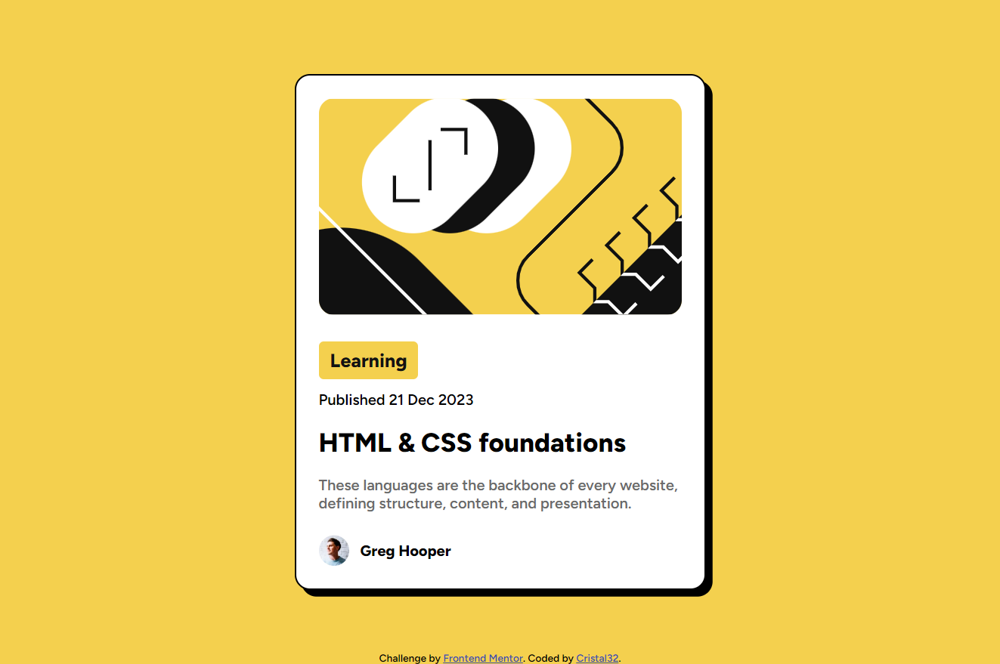
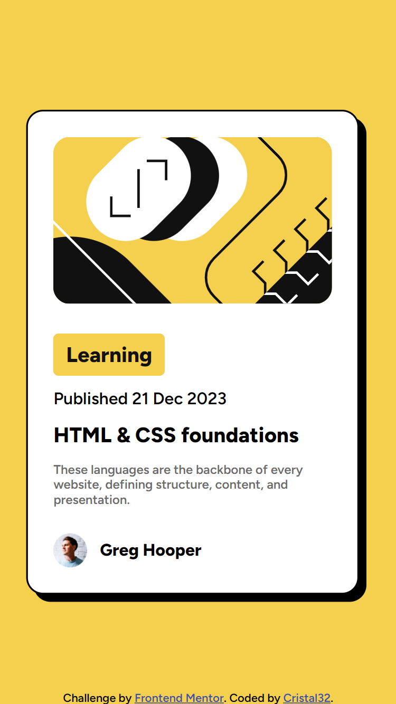

# Frontend Mentor - Blog preview card solution

This is a solution to the [Blog preview card challenge on Frontend Mentor](https://www.frontendmentor.io/challenges/blog-preview-card-ckPaj01IcS).

## Table of contents

- [Overview](#overview)
  - [The challenge](#the-challenge)
  - [Screenshot](#screenshot)
  - [Links](#links)
- [My process](#my-process)
  - [Built with](#built-with)
  - [What I learned](#what-i-learned)
  - [Useful resources](#useful-resources)
- [Author](#author)

## Overview

### The challenge

Users should be able to:

- See hover and focus states for all interactive elements on the page

### Screenshot

- Desktop:



- Mobile:



### Links

- Solution URL: https://github.com/Cristal32/blog-preview-frontendMentor
- Live Site URL: https://cristal32.github.io/blog-preview-frontendMentor/

## My process

### Built with

- Semantic HTML5 markup
- CSS custom properties
- Flexbox
- Mobile-first workflow
- Responsive Design

### What I learned

I learned more about responsive design and the use of media queries. As well as adopting the mobile-first workflow, where we start designing for mobile sizes first, before expanding to larger screens using `@media` with a minimum width that specifies styling towards screens that are larger than that width:

```
@media only screen and (min-width: 431px) {
    .card {
       //...
       width: 384px;
    }
}
```

### Useful resources

- [W3schools](https://www.w3schools.com/css/css_rwd_intro.asp) - This website is very helpful with its detailed and extensive HTML and CSS documentation.

## Author

- Frontend Mentor - [@Cristal32](https://www.frontendmentor.io/profile/Cristal32)

