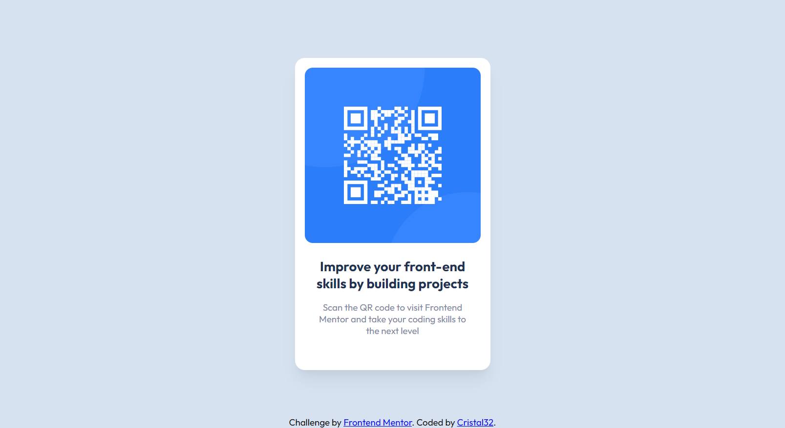

# Frontend Mentor - QR code component solution

This is a solution to the [QR code component challenge on Frontend Mentor](https://www.frontendmentor.io/challenges/qr-code-component-iux_sIO_H).

## Table of contents

- [Overview](#overview)
  - [Screenshot](#screenshot)
  - [Links](#links)
- [My process](#my-process)
  - [Built with](#built-with)
- [Author](#author)

## Overview

### Screenshot

- Desktop Screenshot:

- Mobile Screenshot:

### Links

- Solution URL: [Frontend solution](https://www.frontendmentor.io/solutions/qr-code-component-solution-with-css-flexbox-4e1FKete9H)
- Live Site URL: [Live Demo](https://cristal32.github.io/frontend-mentor-challenges/solutions/01.%20qr-code-component/)

## My process

### Built with

- Semantic HTML5 markup
- CSS custom properties
- Flexbox

## Author

- Frontend Mentor - [@Cristal32](https://www.frontendmentor.io/profile/Cristal32)

