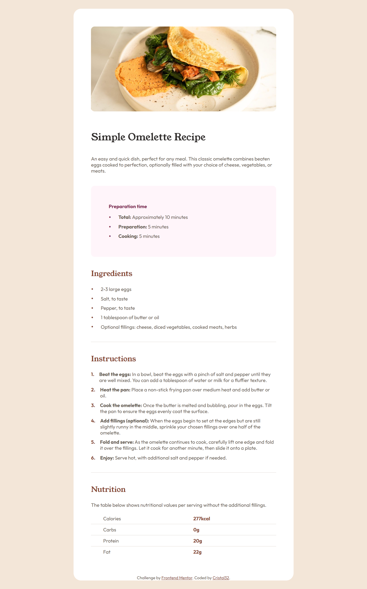
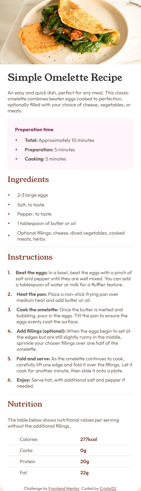

# Frontend Mentor - Recipe page solution

This is a solution to the [Recipe page challenge on Frontend Mentor](https://www.frontendmentor.io/challenges/recipe-page-KiTsR8QQKm).

## Table of contents

- [Overview](#overview)
  - [The challenge](#the-challenge)
  - [Screenshot](#screenshot)
  - [Links](#links)
- [My process](#my-process)
  - [Built with](#built-with)
  - [What I learned](#what-i-learned)
- [Author](#author)

## Overview

### Screenshot

Desktop:



Mobile:



### Links

- Solution URL: [Repository/Code](https://github.com/Cristal32/frontend-mentor-challenges/tree/main/solutions/04.%20recipe-page)
- Live Site URL: [Live Demo](https://cristal32.github.io/frontend-mentor-challenges/solutions/getting-started/04.%20recipe-page/)

## My process

### Built with

- Semantic HTML5 markup
- CSS custom properties
- Flexbox
- CSS Grid
- Mobile-first workflow

### What I learned

Learned a bit more about grid layout, as well as the concept of box sizing.

```css
.img-container {
    /*...*/
    box-sizing: border-box;
    /*...*/
  }
```

Border box allowed my image container to take its set width instead of overflowing outside of the main container.

## Author

- Website - [My Frontend Mentor Challenges](https://cristal32.github.io/frontend-mentor-challenges/)
- Frontend Mentor - [@Cristal32](https://www.frontendmentor.io/profile/Cristal32)
