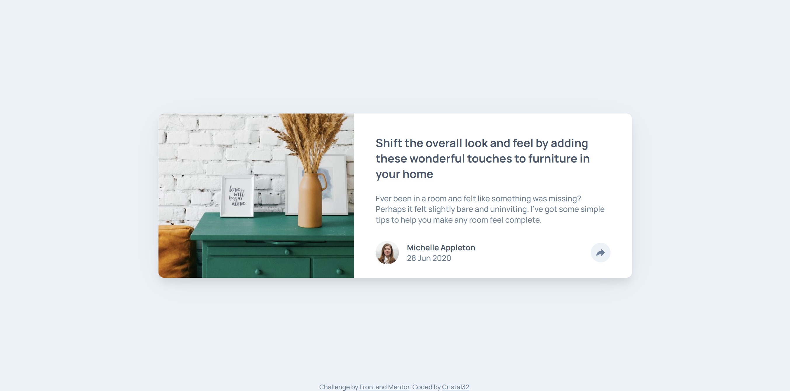

# Frontend Mentor - Article preview component solution

This is a solution to the [Article preview component challenge on Frontend Mentor](https://www.frontendmentor.io/challenges/article-preview-component-dYBN_pYFT). 

## Table of contents

- [Overview](#overview)
  - [The challenge](#the-challenge)
  - [Screenshot](#screenshot)
  - [Links](#links)
- [My process](#my-process)
  - [Built with](#built-with)
  - [What I learned](#what-i-learned)
  - [Useful resources](#useful-resources)
- [Author](#author)

## Overview

### The challenge

Users should be able to:

- View the optimal layout for the component depending on their device's screen size
- See the social media share links when they click the share icon

### Screenshot

- Desktop:



- Mobile:


### Links

- Solution URL: [Repository/Code](https://github.com/Cristal32/frontend-mentor-challenges/tree/main/solutions/javascript-fundamentals/05.%20article-preview-component)
- Live Site URL: [Live Demo](https://cristal32.github.io/frontend-mentor-challenges/solutions/javascript-fundamentals/05.%20article-preview-component/)

## My process

### Built with

- Semantic HTML5 markup
- CSS custom properties
- Flexbox
- Mobile-first workflow

### What I learned

- Smooth appearing animation with translate:

```js
share_btns.forEach((share_btn) => {
    share_btn.addEventListener('click', function() {
            sharebar.classList.toggle('visible');
    });
});
```

```css
.share-bar {
    visibility: hidden;
    opacity: 0;
    z-index: 1;
    transition: transform 330ms ease-in-out, opacity 330ms ease-in-out, visibility 330ms;
    /*...*/
}

.share-bar.visible {
    visibility: visible;
    opacity: 1;
    transform: translateY(-10px);
}
```

When clicking on the share button, it triggers an event listener that toggles the insert/removal of a class `.visible` to the share-bar classList. <br>
Initially, the share bar is invisible. If I click on the share button, it will add the .visible class to the element wich will attribute it the extra CSS properties including making the element visible, switiching opacity to 1 and slightly translating it.

- How to create a text bubble shape with only vanilla CSS:

```css
  .text-bubble {
      position: relative;
      background-color: yellow;
      width: 100px;
      height: 50px;
      margin-bottom: 20px;
  } 
  .text-bubble::after {
    position: absolute;
    display: block; width: 0; content: "";
    border: 15px solid transparent;
    border-top-color: yellow;
    border-bottom: 0;
    bottom: -14px; left: calc(50% - 15px);
  }
```

The `::after` selector is designed to insert something at the end <span style="text-decoration: underline">after</span> the content of the element. So by defining the content after as "" (empty string), and reshaping it into an upside down triangle using the `border` property;

By making the content empty and customizing the borders, we can play around with the 4 sides that form triangle shapes:

```html
<div class="triangles"></div>
```

```css
.triangles {
        width: 0;
        border: 15px solid transparent;
        border-top-color: yellow;
        border-left-color:blue;
        border-bottom-color:pink;
        border-right-color:cyan;
    }
```

By giving a different color to each side, we can start to understand how it works: 


<br><br>

The result with a few adjustments to match the desired design:


### Useful resources

- [20+ CSS Speech Bubbles](https://freefrontend.com/css-speech-bubbles/) - Offers a variety of examples of speech bubbles and their CSS code.

## Author

- Website - [My Frontend Mentor Challenges](https://cristal32.github.io/frontend-mentor-challenges/)
- Frontend Mentor - [@Cristal32](https://www.frontendmentor.io/profile/Cristal32)
